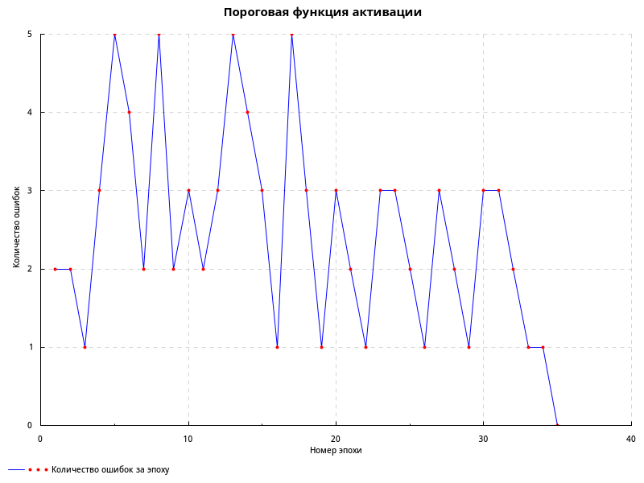
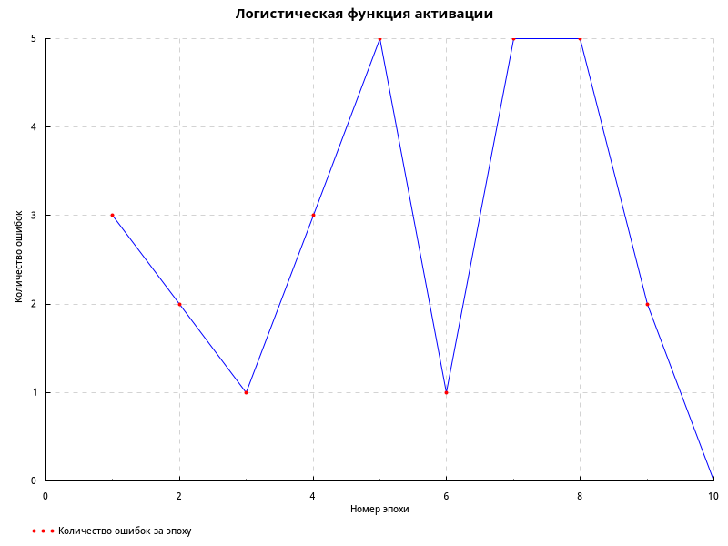

# Лабораторная работа 1

За обучение нейрона отвечает функция `train`, имеющая следующую сигнатуру:

```haskell
train :: Double                 -- learning rate
      -> ActivationFunction     -- activation function
      -> [Double]               -- original function
      -> [([Double], [Double])] -- [(weights, output)]
```

`ActivationFunction` - вспомогательный тип, в котором передаётся информация о функции активации (сама функция и её производная):
```haskell
data ActivationFunction = ActivationFunction
    { primary    :: Double -> Double
    , derivative :: Double -> Double
    }
```

Все функции для выполнения расчётов определены в модуле [Data.Neuron](src/Data/Neuron.hs).

[Точка входа](app/Main.hs) содержит лишь обработку полученных результатов.

## Задание 1

Промежуточные результаты (таблица с весами по окончании эпохи, реальным выходом и числом ошибок):

```bash
 0.0000, 0.0000, 0.0000, 0.3000, 0.3000	1,1,1,1,1,1,1,1,1,1,1,1,1,0,0,0	 2
 0.0000, 0.0000, 0.0000, 0.6000, 0.6000	1,1,1,1,1,1,1,1,1,1,1,1,1,0,0,0	 2
-0.3000,-0.3000,-0.3000, 0.6000, 0.6000	1,1,1,1,1,1,1,1,1,1,1,1,1,0,0,1	 1
 0.0000,-0.6000,-0.3000, 0.6000, 0.6000	0,1,1,1,0,1,1,1,1,1,1,1,1,0,0,1	 3
 0.3000,-0.6000,-0.3000, 0.9000, 0.6000	1,1,1,1,0,1,1,1,0,1,1,1,1,1,0,0	 5
 0.3000,-0.6000,-0.6000, 0.9000, 0.9000	1,1,1,1,1,1,1,1,0,1,1,1,1,0,1,0	 4
 0.3000,-0.9000,-0.6000, 0.9000, 0.6000	1,1,1,1,0,1,1,1,1,1,1,1,0,1,0,1	 2
 0.6000,-0.9000,-0.6000, 0.9000, 0.9000	1,1,1,1,0,1,1,1,0,1,1,1,1,0,1,0	 5
 0.6000,-0.9000,-0.9000, 0.9000, 0.6000	1,1,1,1,1,1,1,1,0,1,1,1,0,1,0,1	 2
 0.9000,-0.9000,-0.6000, 1.2000, 0.6000	1,1,1,1,0,1,1,1,1,1,1,1,0,1,0,0	 3
 0.9000,-0.9000,-0.6000, 1.5000, 0.6000	1,1,1,1,1,1,1,1,1,1,1,1,0,1,0,0	 2
 0.6000,-1.2000,-0.9000, 1.5000, 0.6000	1,1,1,1,1,1,1,1,1,1,1,1,0,1,1,0	 3
 0.9000,-1.2000,-0.9000, 1.5000, 0.6000	1,1,1,1,0,1,1,1,0,1,1,1,0,1,1,0	 5
 0.9000,-1.2000,-1.2000, 1.5000, 0.6000	1,1,1,1,1,1,1,1,0,1,1,1,0,1,1,0	 4
 1.2000,-1.2000,-0.9000, 1.5000, 0.9000	1,1,1,1,0,1,1,1,1,1,1,1,0,0,1,0	 3
 0.9000,-1.5000,-1.2000, 1.5000, 0.6000	1,1,1,1,1,1,1,1,1,1,1,1,0,1,0,1	 1
 1.2000,-1.5000,-1.2000, 1.5000, 0.6000	1,1,1,1,0,1,1,1,0,1,1,1,0,1,1,0	 5
 1.5000,-1.2000,-1.2000, 1.5000, 0.9000	1,1,1,1,1,1,1,1,0,1,1,1,0,0,1,0	 3
 1.2000,-1.5000,-1.5000, 1.5000, 0.6000	1,1,1,1,1,1,1,1,1,1,1,1,0,1,0,1	 1
 1.5000,-1.5000,-1.2000, 1.5000, 0.9000	1,1,1,1,0,1,1,1,1,1,1,1,0,0,1,0	 3
 1.5000,-1.5000,-1.2000, 1.5000, 1.2000	1,1,1,1,1,1,1,1,1,1,1,1,0,0,1,0	 2
 1.2000,-1.8000,-1.5000, 1.5000, 0.9000	1,1,1,1,1,1,1,1,1,1,1,1,0,1,0,1	 1
 1.5000,-1.8000,-1.5000, 1.5000, 0.6000	1,1,1,1,0,1,1,1,0,1,1,1,0,1,0,1	 3
 1.8000,-1.5000,-1.5000, 1.5000, 0.9000	1,1,1,1,1,1,1,1,0,1,1,1,0,0,1,0	 3
 1.8000,-1.5000,-1.5000, 1.5000, 1.2000	1,1,1,1,1,1,1,1,1,1,1,1,0,0,1,0	 2
 1.5000,-1.8000,-1.8000, 1.5000, 0.9000	1,1,1,1,1,1,1,1,1,1,1,1,0,1,0,1	 1
 1.8000,-1.8000,-1.5000, 1.5000, 1.2000	1,1,1,1,0,1,1,1,1,1,1,1,0,0,1,0	 3
 1.8000,-1.8000,-1.5000, 1.5000, 1.5000	1,1,1,1,1,1,1,1,1,1,1,1,0,0,1,0	 2
 1.5000,-2.1000,-1.8000, 1.5000, 1.2000	1,1,1,1,1,1,1,1,1,1,1,1,0,1,0,1	 1
 1.8000,-2.1000,-1.8000, 1.5000, 0.9000	1,1,1,1,0,1,1,1,0,1,1,1,0,1,0,1	 3
 2.1000,-1.8000,-1.8000, 1.5000, 1.2000	1,1,1,1,1,1,1,1,0,1,1,1,0,0,1,0	 3
 2.1000,-1.8000,-1.8000, 1.5000, 1.5000	1,1,1,1,1,1,1,1,1,1,1,1,0,0,1,0	 2
 1.8000,-2.1000,-2.1000, 1.5000, 1.2000	1,1,1,1,1,1,1,1,1,1,1,1,0,1,0,1	 1
 2.1000,-2.1000,-1.8000, 1.5000, 1.2000	1,1,1,1,0,1,1,1,1,1,1,1,0,0,0,1	 1
 2.1000,-2.1000,-1.8000, 1.5000, 1.2000	1,1,1,1,1,1,1,1,1,1,1,1,0,0,0,1	 0
```

Зависимость количества ошибок от номера эпохи:



## Задание 2

Промежуточные результаты (таблица с весами по окончании эпохи, реальным выходом и числом ошибок):

```bash
 0.1414,-0.0086,-0.0086, 0.1381, 0.1381	0,1,1,1,1,1,1,1,1,1,1,1,1,0,0,0	 3
 0.1434,-0.0066,-0.0066, 0.2878, 0.2878	1,1,1,1,1,1,1,1,1,1,1,1,1,0,0,0	 2
-0.0041,-0.1541,-0.1541, 0.2878, 0.2878	1,1,1,1,1,1,1,1,1,1,1,1,1,0,0,1	 1
 0.1487,-0.3013,-0.1513, 0.2878, 0.2878	0,1,1,1,0,1,1,1,1,1,1,1,1,0,0,1	 3
 0.3132,-0.2868,-0.1368, 0.4355, 0.2898	1,1,1,1,0,1,1,1,0,1,1,1,1,1,0,0	 5
 0.1679,-0.4321,-0.2821, 0.4355, 0.1445	1,1,1,1,1,1,1,1,1,1,1,1,0,1,0,1	 1
 0.2905,-0.4575,-0.3075, 0.4118, 0.2706	1,1,1,1,0,1,1,1,0,1,1,1,1,0,1,0	 5
 0.4364,-0.4616,-0.3115, 0.4054, 0.4130	1,1,1,1,0,1,1,1,0,1,1,1,1,0,1,0	 5
 0.4557,-0.4423,-0.4422, 0.4054, 0.2823	1,1,1,1,1,1,1,1,0,1,1,1,0,1,0,1	 2
 0.4557,-0.4423,-0.4422, 0.4054, 0.2823	1,1,1,1,1,1,1,1,1,1,1,1,0,0,0,1	 0
```

Зависимость количества ошибок от номера эпохи:



## Задание 3

На следующих наборах:

```bash
1,0,1,1,1
1,1,0,0,0
1,1,1,0,1
1,1,1,1,0
```

удалось полностью обучить нейрон. Полученные коэффициенты: `0.2928,-0.2822,-0.2838, 0.1265, 0.1647`. Потребовалось 7 эпох.
