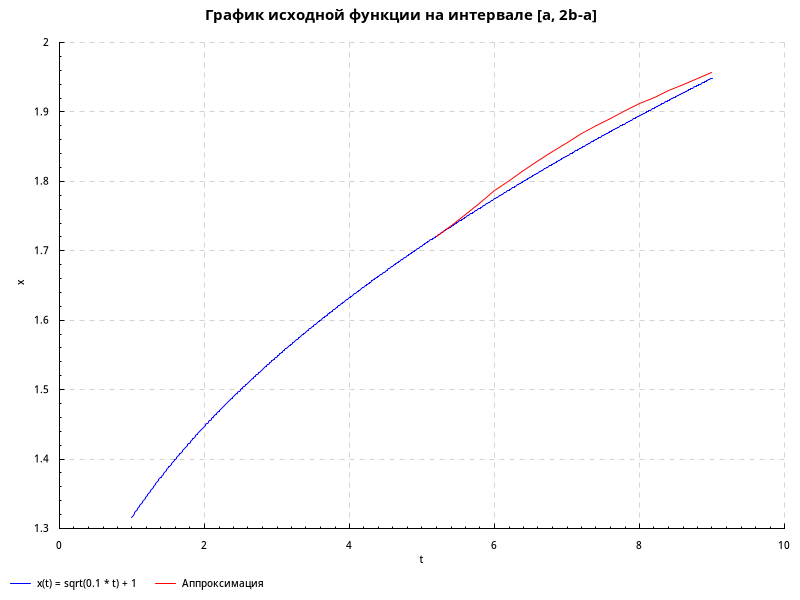

# Лабораторная работа 3

* Результат работы при обучении в течении 4000 эпох с коэффициентом обучения 0.1 и размером окна 6:

Средняя квадратичная погрешность в таком случае равна 0.0051

* 2000 эпох, норма обучения 0.1 и размер окна 6:

Средняя квадратичная погрешность в таком случае равна 0.0079

* 4000 эпох, норма обучения 0.05 и размер окна 6:

Средняя квадратичная погрешность в таком случае равна 0.0049

* 4000 эпох, норма обучения 0.05 и размер окна 6:

Средняя квадратичная погрешность равна 0.0111

* 4000 эпох, норма обучения 0.1 и размер окна 4:

* 4000 эпох, норма обучения 0.1 и размер окна 5:

