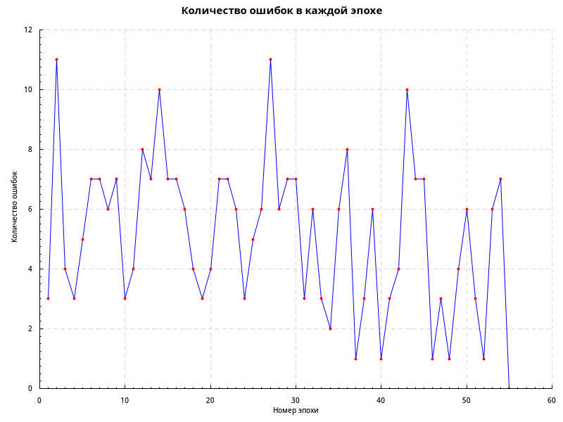

# Лабораторная работа 4

Вся логика работы RBF сети определена в модуле [Numeric.Neural.RBF](src/Numeric/Neural/RBf.hs).
В [точке входа](app/Main.hs) содержится лишь подготовка данных к обработке функциями из этого модуля,
а также обработка полученных результатов.

Были получены следующие результаты:

* Минимальный набор для обучения: (0, 1, 0, 1), (0, 1, 1, 1), (1, 0, 0, 0), (1, 1, 0, 1), (1, 1, 1, 0).
* Обучение заняло 55 эпох.
* Итоговые веса: (-12.300, 1.418, 0.522, 0.872)

График зависимости количества ошибок от номера эпохи:

