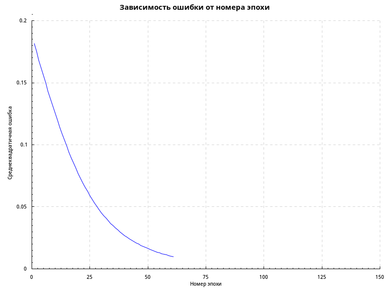

# Лабораторная работа 6

| Вариант | Архитектура | x        | 10t     |
|---------|-------------|----------|---------|
| 6       | 2-1-2       | (1,1,-1) | (2, -1) |

На обучения ушла 61 эпоха.

|k|Выход НС|E(k)|
|--|-----|---|
|   1| ( 0.034, -0.028) |0.1814|
|   2| ( 0.039, -0.032) |0.1748|
|   3| ( 0.044, -0.036) |0.1683|
|   4| ( 0.050, -0.040) |0.1618|
|   5| ( 0.055, -0.044) |0.1555|
|   6| ( 0.060, -0.048) |0.1493|
|   7| ( 0.065, -0.051) |0.1431|
|   8| ( 0.071, -0.055) |0.1371|
|   9| ( 0.076, -0.058) |0.1312|
|  10| ( 0.081, -0.061) |0.1254|
|  11| ( 0.086, -0.064) |0.1198|
|  12| ( 0.091, -0.067) |0.1143|
|  13| ( 0.095, -0.070) |0.1090|
|  14| ( 0.100, -0.072) |0.1039|
|  15| ( 0.104, -0.075) |0.0989|
|  16| ( 0.109, -0.077) |0.0941|
|  17| ( 0.113, -0.079) |0.0895|
|  18| ( 0.117, -0.081) |0.0851|
|  19| ( 0.121, -0.083) |0.0808|
|  20| ( 0.125, -0.085) |0.0768|
|  21| ( 0.128, -0.087) |0.0729|
|  22| ( 0.132, -0.088) |0.0691|
|  23| ( 0.135, -0.090) |0.0656|
|  24| ( 0.138, -0.091) |0.0622|
|  25| ( 0.142, -0.092) |0.0590|
|  26| ( 0.144, -0.093) |0.0560|
|  27| ( 0.147, -0.094) |0.0531|
|  28| ( 0.150, -0.095) |0.0503|
|  29| ( 0.152, -0.096) |0.0477|
|  30| ( 0.155, -0.097) |0.0452|
|  31| ( 0.157, -0.098) |0.0429|
|  32| ( 0.159, -0.098) |0.0407|
|  33| ( 0.161, -0.099) |0.0386|
|  34| ( 0.163, -0.100) |0.0366|
|  35| ( 0.165, -0.100) |0.0347|
|  36| ( 0.167, -0.101) |0.0330|
|  37| ( 0.169, -0.101) |0.0313|
|  38| ( 0.170, -0.101) |0.0297|
|  39| ( 0.172, -0.102) |0.0282|
|  40| ( 0.173, -0.102) |0.0268|
|  41| ( 0.175, -0.102) |0.0255|
|  42| ( 0.176, -0.102) |0.0242|
|  43| ( 0.177, -0.103) |0.0230|
|  44| ( 0.178, -0.103) |0.0219|
|  45| ( 0.179, -0.103) |0.0208|
|  46| ( 0.180, -0.103) |0.0198|
|  47| ( 0.181, -0.103) |0.0189|
|  48| ( 0.182, -0.103) |0.0180|
|  49| ( 0.183, -0.103) |0.0171|
|  50| ( 0.184, -0.103) |0.0163|
|  51| ( 0.185, -0.103) |0.0156|
|  52| ( 0.186, -0.104) |0.0148|
|  53| ( 0.186, -0.104) |0.0142|
|  54| ( 0.187, -0.104) |0.0135|
|  55| ( 0.188, -0.104) |0.0129|
|  56| ( 0.188, -0.104) |0.0123|
|  57| ( 0.189, -0.104) |0.0118|
|  58| ( 0.189, -0.104) |0.0113|
|  59| ( 0.190, -0.104) |0.0108|
|  60| ( 0.190, -0.103) |0.0103|
|  61| ( 0.191, -0.103) |0.0098|

Зависимость среднеквадратичной ошибки от номера эпохи:

