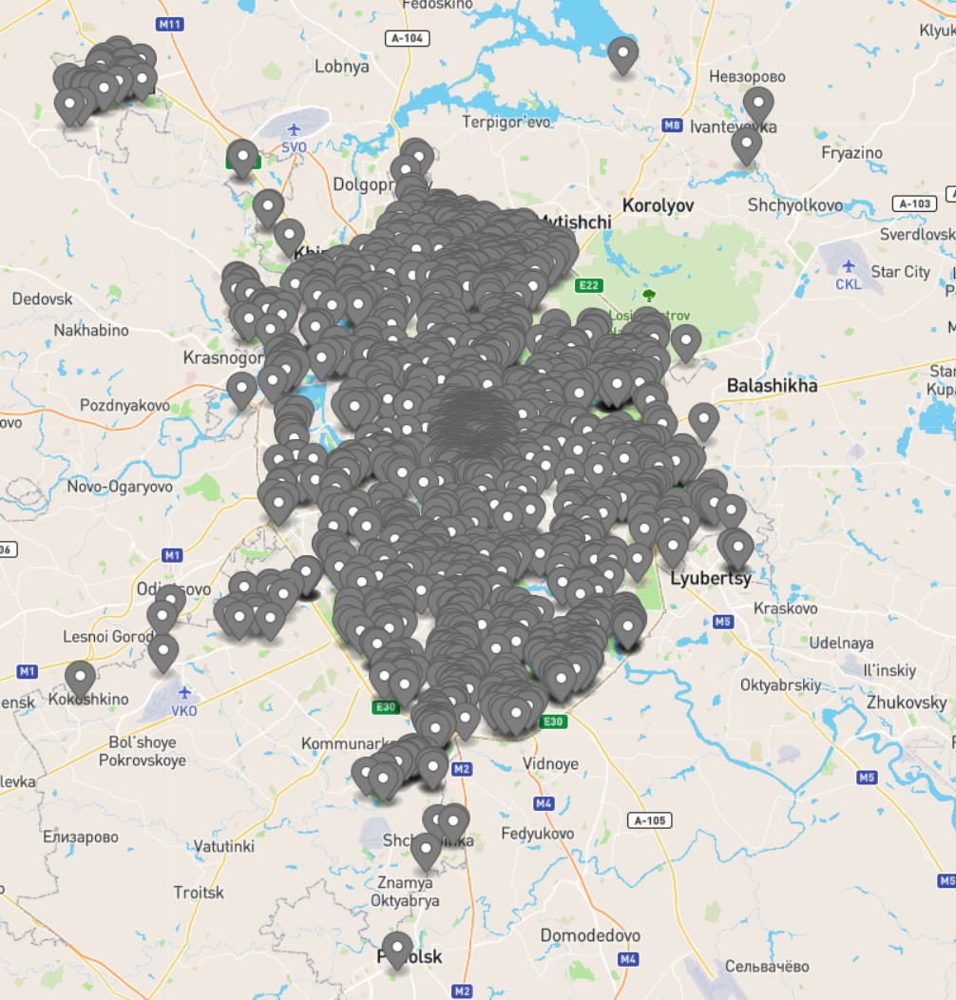
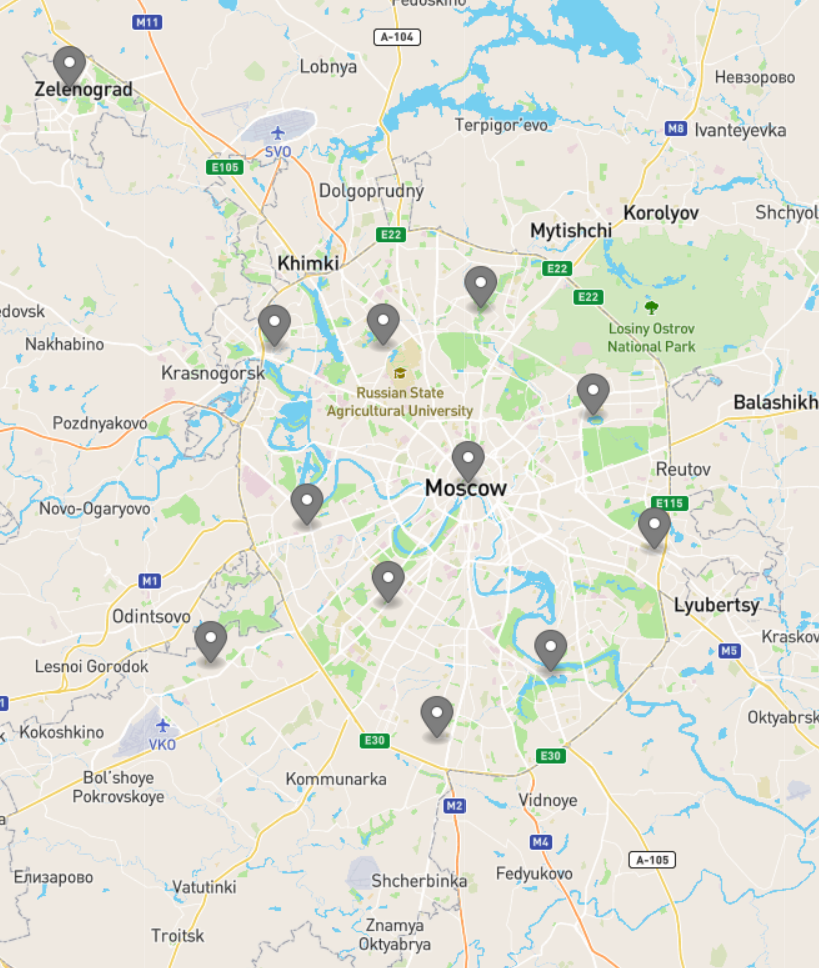
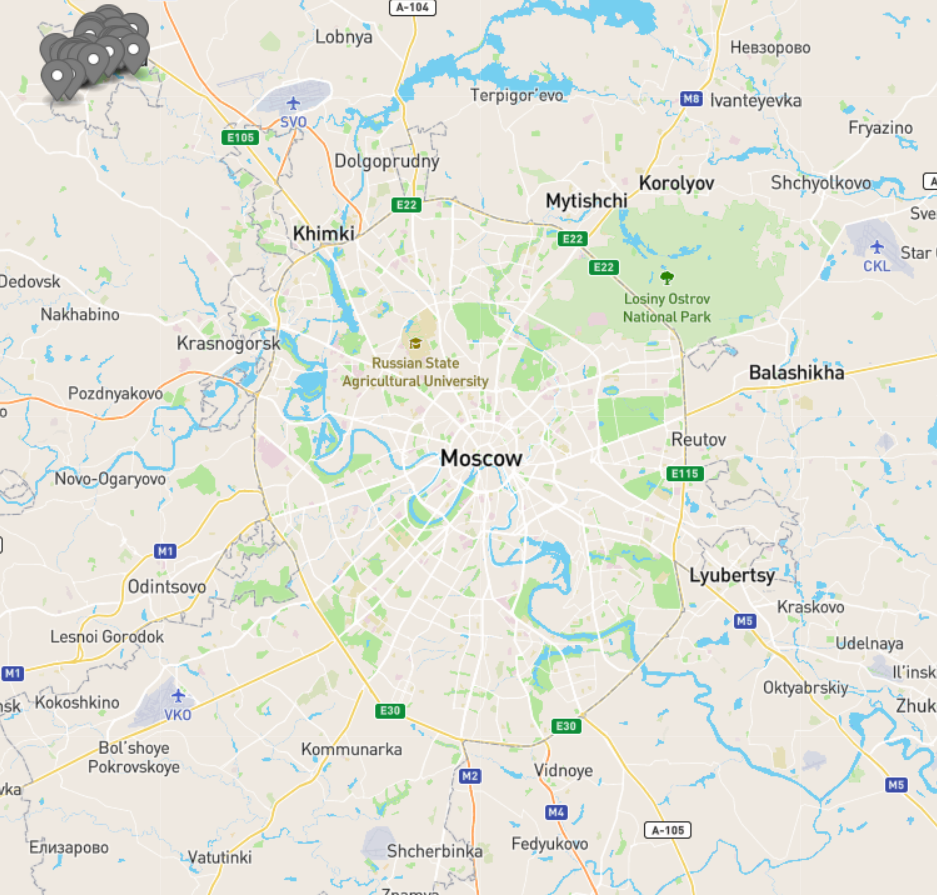

# Лабораторная работа 9

Для выполнения лабораторной работы была реализована программа,
которая является утилитой командной строки и принимает следующие аргументы:

```bash
Clusterize data for lab09

Usage: lab09-exe (-i|--input INPUT) (-o|--output OUTPUT)
                 (-c|--clusters DATA_OUTPUT)
  Clusterize data

Available options:
  -i,--input INPUT         Input file with data to be clusterized
  -o,--output OUTPUT       Output file for the centers
  -c,--clusters DATA_OUTPUT
                           Output file for clusters
  -h,--help                Show this help text
```

Программе на вход подаётся путь к файлу с [исходными данными](data/data.json) -
данные о расположении велопарковок г. Москвы в формате GeoJSON.

Результатом работы программы являются два файла в формате GeoJSON.
[Первый файл](data/centers.json) - центры кластеров.
[Второй файл](data/clusters.json) - списки кластеров.

## Работа программы

Для наглядности на карте ниже приведены данные для кластеризации:



В результате получились следующие центры кластеров:



Ниже результаты для каждого округа:

* ЗелАО


